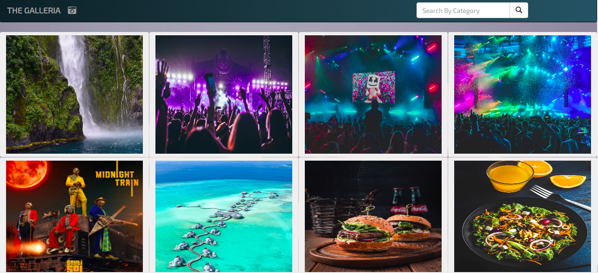

### GALLERIA

#  By Cecilia Barasa

## Description
This is a web application that allows aa user to view images based on the category and location.

# Preview

## User Stories
# As a user you are able to;
* View different photos that interest you.
* Click on a single photo to expand it and also view the details of the photo.
* Search for different categories of photos. (ie. Travel, Food)
* Copy a link to the photo to share with my friends.
* View photos based on the location they were taken.

# Setup and installation requirements
* `Virtual environment`
* `pip install -r requirements.txt`

# Technologies used
* `Python3.6.9`
* `Django3.0.7`
* `HTML`
* `CSS`
* `JAVASCRIPT`

### 

## [Support and contact details](https://www.linkedin.com/in/cecilia-barasa-4a8311195/)